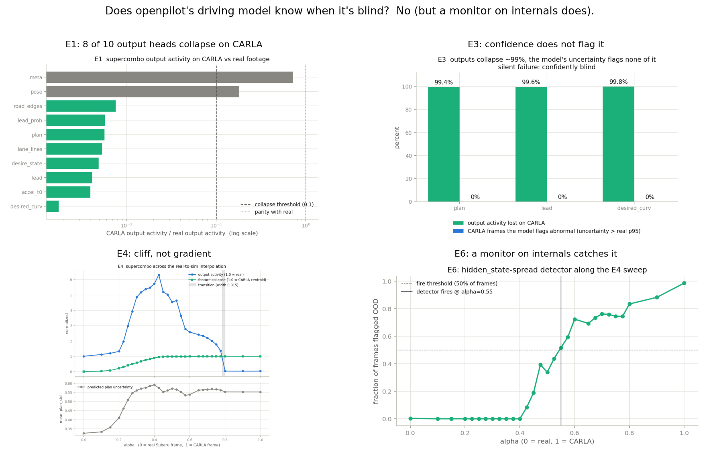
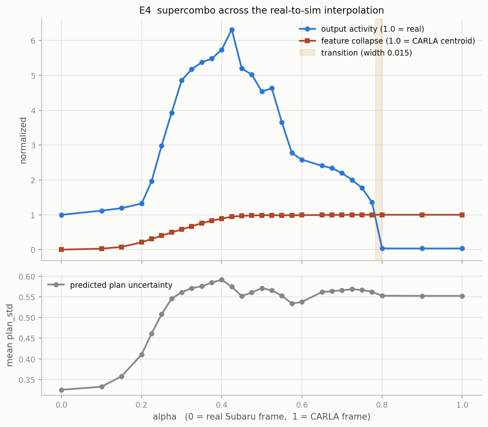
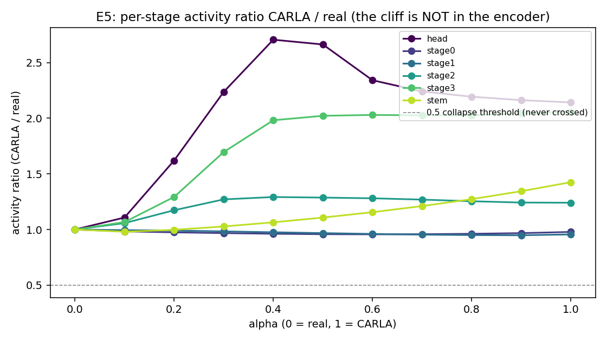
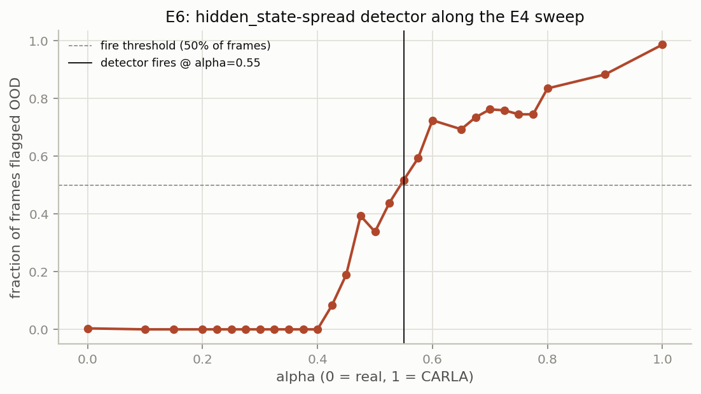
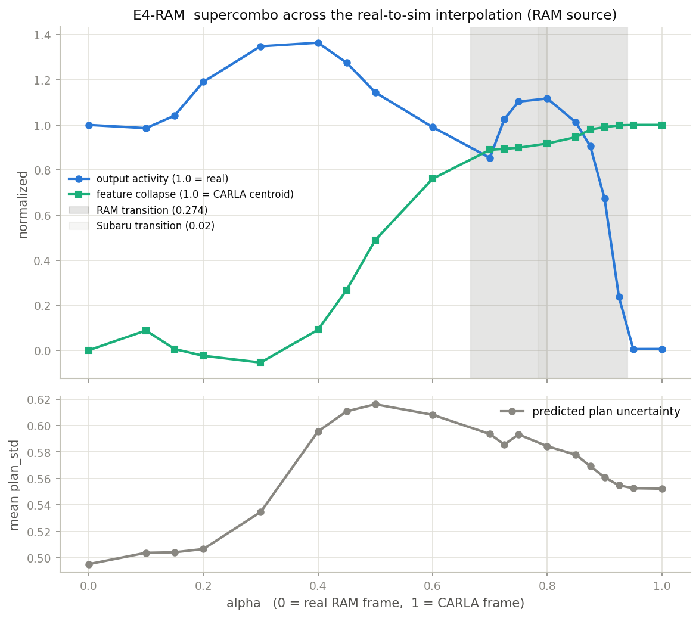
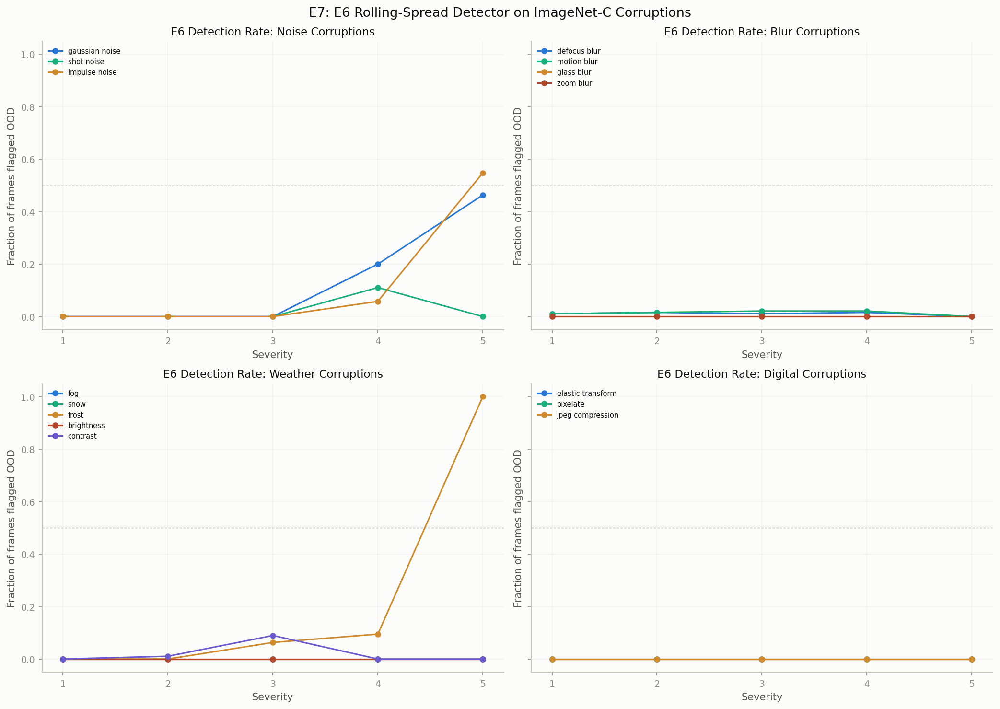
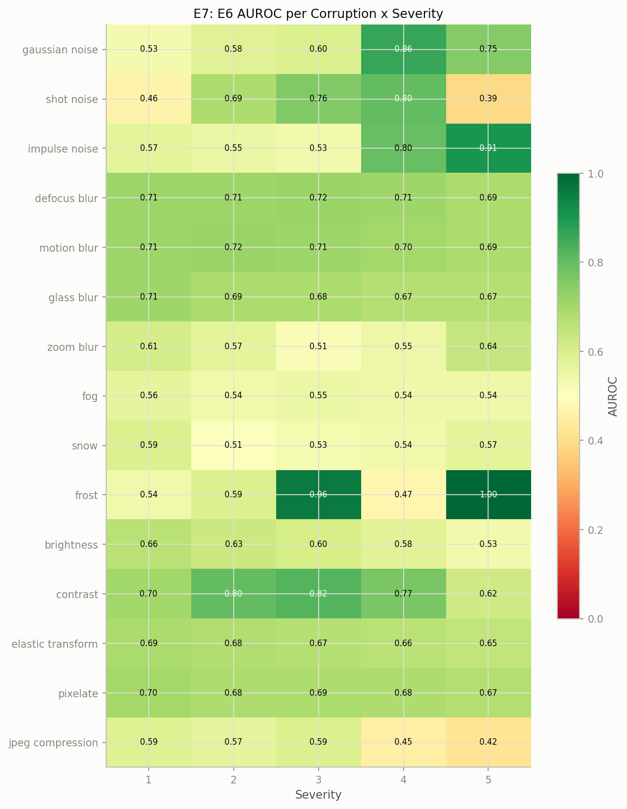

# supercombo-blindspot

**Does a production L2 self-driving model know when it is blind? It does not, and it fails silently.**

[](https://github.com/yusufdxb/supercombo-blindspot/actions/workflows/ci.yml)
&nbsp;[](https://github.com/commaai/openpilot)
&nbsp;[](#reproducibility)

<p align="center">
  <a href="https://youtu.be/tnM18XGbNMY">
    
  </a>
  <br>
  <em>Watch the real model go blind (60s). The dashcam image is shifted toward simulator while the predicted path collapses and the model's confidence barely reacts. Real night and glare do not collapse it; the failure is sim-specific.</em>
</p>

`supercombo` is the end-to-end neural network that drives [openpilot](https://github.com/commaai/openpilot),
the L2 driver-assistance system deployed on comma hardware on public roads. This project instruments
openpilot's shipped `supercombo` model and resolves a single safety question:

> Presented with input drawn from outside its training distribution, does the model fail conspicuously or silently?

**Measured at the model's own output channels, the answer is: silently.** On
CARLA-rendered driving scenes, openpilot v0.9.7's outputs go near-constant
across 8 of its 10 tracked output readouts, its internal recurrent state contracts to a single point, and its
exported predictive-uncertainty heads rise so little that they never depart the model's nominal
real-driving range. No quantity the model emits would signal to a downstream monitor that it has
ceased to perceive. An internal recurrent signal *does* encode the failure and is recoverable (E6),
but the model never exposes it.

A full writeup is available at [Silent Collapse: A Distribution-Shift Teardown of a Production Driving Model](https://yusufdxb.github.io/papers/silent-collapse-distribution-shift-teardown.pdf). The manuscript source is in [`paper/manuscript.md`](paper/manuscript.md). It has not been submitted.

---

## Contents

- [Findings](#findings)
- [Scope of claims](#scope-of-claims)
- [Significance](#significance)
- [Controls and validity](#controls-and-validity)
- [Experiments](#experiments)
- [Generalization and deployment](#generalization-and-deployment)
- [Limitations](#limitations)
- [Reproducibility](#reproducibility)
- [Repository layout](#repository-layout)
- [Environment](#environment)
- [Attribution and disclaimer](#attribution-and-disclaimer)

---

## Findings



The study rests on a **parity-controlled** reimplementation of openpilot v0.9.7 `supercombo` inference,
agreeing with comma's own reference output on real footage to **100% of 1159 frames within
±0.5 m/s²** (median absolute deviation 0.04 m/s²). With this control established, the negative result
below is attributable to the model rather than to the harness. The model was then evaluated on real
comma footage against CARLA renders, with every output head, every predicted uncertainty, and the
internal feature vector instrumented.

| | Experiment | Result |
|---|---|---|
| **E1** | output collapse | 8 / 10 tracked output readouts (7 heads + 3 scalars derived from them: plan, lane lines, road edges, lead, curvature, ...) fall to **< 1%** of their real-footage temporal activity on simulated input |
| **E2** | latent-space OOD | the 512-D recurrent feature vector contracts to **0.00001×** the real spread: 219 distinct simulated frames map onto a single point |
| **E3** | uninformative uncertainty | outputs shed **~99.5%** of their activity, yet predicted uncertainty rises only 1.2-1.8×, and **0%** of simulated frames exceed the model's nominal real-driving uncertainty |
| **E4** | discontinuous onset | under a real-to-CARLA blend, output activity first inflates to **6.3×** baseline (ghosted-input thrash), then collapses across a **hard discontinuity** at ~78% CARLA (transition width **0.015**); uncertainty never responds |
| **E5** | encoder stays active | per-stage temporal activity (CARLA / real) holds at or above baseline through the full sweep (minimum 0.96; several stages amplify 1.4-2.1×). Activity magnitude is not proof of correct perception, but it rules out an encoder that has gone quiescent: the earliest contraction among probed tensors is **downstream** of the encoder, in the recurrent / policy stack |
| **E6** | internal detectability | a 1st-percentile threshold on the rolling spread of the model's own 512-D recurrent vector fires on >50% of CARLA-blended frames at alpha 0.550, well ahead of the E4 discontinuity at ~0.78. Leave-one-corpus-out across four real corpora yields a **2.41%** mean false-positive rate (95% CI [0%, 5.17%]) |
| **E7** | bounded coverage | over 15 ImageNet-C corruptions × 5 severities, E6 (a collapse detector) largely misses photometric corruption (mean AUROC 0.52-0.74); feature-space baselines (Mahalanobis) recover what E6 cannot |

Every public claim and its boundary is registered in [`docs/evidence_register.md`](docs/evidence_register.md).

## Scope of claims

What this project does and does not assert, partitioned by confidence:

| Bucket | Claims |
|---|---|
| **VERIFIED** (v0.9.7, CARLA, Subaru/RAM) | E1: 8/10 tracked output readouts fall below 1% of real activity. E2: the recurrent feature reaches 87.9% in-sample centroid-direction classification accuracy against real (d'=2.19); held-out evidence is the LOCO analysis, not this number. E3: exported uncertainty heads rise only 1.20-1.84×; 0/219 CARLA frames exceed the real p95. E4: the collapse is a hard discontinuity on Subaru (width 0.015) and a gradient on RAM (width 0.274). |
| **REPLICATED on v0.9.6** | v0.9.6's exported uncertainty is likewise blind to the shift while its internal feature space stays highly discriminative (d'=6.8, 100% in-sample centroid-direction accuracy). |
| **CONFOUNDS EXCLUDED AS SUFFICIENT (E9, E9b)** | Matching CARLA's low-level pixel statistics to real (moment / marginal-histogram / low-frequency Fourier) does not lift the recurrent freeze, though output quiescence partly recovers (readouts below 1% fall 8/10 → 1-3/10). Swapping only the zero-calibration warp onto real footage does not collapse it (0/10 readouts below either threshold, though 89.4% separable); CARLA still freezes under the identical warp. Neither low-level statistics nor the calibration warp is sufficient to explain the freeze. |
| **DIFFERS on v0.9.6** | The silent freeze does not reproduce (1/10 heads collapse vs 8/10); the model instead fails by chaotic amplification. The E6 monitor does not transfer (33% LOCO FPR vs 2.4% on v0.9.7). |
| **MONITOR-ONLY (E6)** | The rolling recurrent-spread detector is a collapse detector, not a general OOD detector. E7 demonstrates that photometric corruptions evade it (mean AUROC 0.52-0.74). |
| **DEPLOYMENT-UNSUPPORTED** | Expanding clean-real calibration from N=2 to N=4 raised the LOCO mean FPR from 1.03% to 2.41% (95% CI [0%, 5.17%], 6.90% maximum on the ram fold). A fleet-scale FPR remains unproven and is likely higher. |
| **OPEN** | One real daytime-dry segment intermittently enters a near-zero recurrent attractor (E6 fires on 60.34% of analyzed frames) under clean, correctly-warped input. The trigger is unexplained; an initial steer/speed hypothesis was falsified. |

## Significance

Every L2 and autonomous-driving program validates in simulation. If a production driving model is
out-of-distribution-blind to that simulator, sim passes confer false confidence: the vehicle appears
to drive (stable, benign, plausible outputs) because the model has **collapsed onto a benign default
output**, not because it perceives the scene. And because the model's own uncertainty heads do not
register the collapse (E3), the condition is undetectable from model outputs alone. Detecting it
requires an external distribution-shift monitor.

This is consistent with comma's own experience: openpilot's official simulator bridge (MetaDrive) is
[reported to drive erratically](https://github.com/commaai/openpilot/issues/31711), and comma
employs simulation for integration and CI testing rather than for trusting model behavior.

**Provenance.** The project began as an attempt to reproduce a documented openpilot failure,
[phantom braking at highway overpass shadows](https://github.com/commaai/openpilot/issues/20704),
inside CARLA. The reproduction harness was built and functions (`src/scenario.py`), but the model
did not respond to the simulated scenes. Investigating that non-response produced the teardown above,
and the project pivoted from reproducing a known bug to rigorously characterizing a silent failure
mode. The phantom-braking harness was retained as the control that exposed the result.

## Controls and validity

- **Parity control.** `src/run_parity.py` reproduces comma's v0.9.7 reference output on a real
  segment to 100% within ±0.5 m/s², foreclosing the first objection any reviewer would raise, that
  the reimplementation is itself at fault, before a single claim is made.
- **Responsiveness on real data.** Every output head exhibits substantial frame-to-frame activity on
  real footage (E1, "real activity" column); the collapse is specific to simulation.
- **Two real segments, two vehicles** (Subaru highway, RAM), each initialized from an independent
  recurrent state with the warmup transient discarded, so the real baseline is neither a single
  recording nor contaminated by initialization.
- **Reported null result on the original objective.** `src/scout_phantom.py` scanned v0.9.7's output
  on real drives for phantom brakes and found legitimate curve and intersection braking but **no
  confirmed phantom brake** in the sample. Phantom braking is rare and the readily accessible data is
  failure-poor: a substantive finding about the difficulty of the original problem, reported rather
  than suppressed.

## Experiments

<details>
<summary><b>E1: Output collapse map</b></summary>

For each output head, the temporal activity (mean per-element standard deviation across frames) on
CARLA versus real footage. 8 of 10 heads fall below 1% of real activity, including every perception
head (`lane_lines`, `road_edges`, `lead`) and every planning head (`plan`, `accel`, `desired_curv`,
`desire_state`). `pose` (ego-motion) partially survives at 18%, plausibly because it is driven by
frame-to-frame optical flow, which retains some signal even in simulation. `meta` (disengage and
blinker probabilities) is low-activity on real footage as well.

Full table: [`report/teardown_results.md`](report/teardown_results.md).
</details>

<details>
<summary><b>E2: Out-of-distribution inside the model</b></summary>


`supercombo` carries a 512-D `hidden_state` feature vector. Projected to two dimensions (PCA fit on
real features), real driving disperses across the feature space while **219 distinct CARLA frames
contract to a single point** (feature spread 0.00001× of real). The model's internal representation
of the simulated world is frozen and degenerate.
</details>

<details>
<summary><b>E3: The silent failure</b></summary>


`supercombo`'s plan, lead, and curvature heads emit predicted uncertainties (MDN standard
deviations). Were the model to register that it had left its training distribution, these would
spike. They do not: outputs shed ~99.5% of their activity, predicted uncertainty rises only 1.2-1.8×,
and **not one CARLA frame's uncertainty exceeds the model's 95th-percentile uncertainty on nominal
real driving.** Any monitor thresholded to avoid false alarms on real driving would never fire. The
exported uncertainty channel is confidently silent about the collapse, even though (E6) an internal
recurrent-spread signal carries the information.
</details>

<details>
<summary><b>E4: Discontinuous onset</b></summary>



E1-E3 establish that the model collapses on CARLA; E4 characterizes *how the collapse arrives*. Each
real Subaru model-frame is blended with a CARLA frame, `X(alpha) = (1-alpha)·real + alpha·CARLA`,
swept across 29 auto-refined alpha points. Across the first ~78% of the blend the model never
degrades gracefully: output activity instead *inflates*, peaking at **6.3× baseline** near alpha 0.42
as the ghosted double-exposure drives erratic, high-variance output. Then, within a **0.015-wide
window near alpha 0.79**, activity falls across a discontinuity from 1.4× to 0.03× of real. The
512-D recurrent vector, by contrast, migrates smoothly to the CARLA centroid and saturates by alpha
0.47, so the internal representation collapses well before the outputs do. Predicted uncertainty
remains flat through the discontinuity: E3's silent failure holds across the entire interpolation.

The blend superimposes two scenes, so intermediate frames are a double-exposure rather than a
content-preserving morph: E4 is an overlay-interference probe along a monotone real-to-sim axis.
Full table: [`report/e4_results.md`](report/e4_results.md).
</details>

<details>
<summary><b>E5: Is the collapse in the encoder, or downstream of it?</b></summary>



Exposing one intermediate tensor per vision-encoder stage (stem, stages.0-3, post-pool flatten) in
the ONNX graph and re-running the E4 sweep contradicts the naive hypothesis: across all six encoder
layers, temporal activity on CARLA holds at or above baseline, and several stages amplify (stage3
2.06×, head 2.14×). No encoder stage collapses. Absolute mean magnitudes *do* shift (stem 1.24×, head
1.33×), so the encoder produces differently-distributed but fully temporally-active features. The
collapse in E1/E2 is therefore not the encoder falling silent but the recurrent / policy stack
contracting the encoder's variation-rich features into a degenerate hidden state. The OOD failure
mode is one of temporal aggregation, not perception.

Full table: [`report/e5_results.md`](report/e5_results.md).
</details>

<details>
<summary><b>E6: Could a downstream monitor have caught this?</b></summary>



Rather than trust any output head, observe the rolling spread of `supercombo`'s own 512-D recurrent
vector. Calibrating the fire threshold at the 1st percentile of the rolling spread on real driving
and evaluating by leave-one-corpus-out across four real corpora (subaru, ram, ev6_night,
bronco_night) yields a **2.41% mean held-out FPR** (segment-level bootstrap 95% CI [0%, 5.17%], 6.90%
maximum on the ram fold). The initial two-corpus estimate of 1.03% was optimistic; the corpora carry
materially different rolling-spread distributions (subaru median 0.12 vs ram median 0.19), which is
precisely why the generalization gap matters. On the E4 sweep the detector fires on >50% of frames at
alpha 0.550, whereas the output-collapse discontinuity does not arrive until ~0.78: a lightweight
external monitor observing internal state can flag the OOD condition before the model's own outputs
betray it.

Full table: [`report/e6_results.md`](report/e6_results.md) and [`report/corpus_scaling_results.md`](report/corpus_scaling_results.md).
</details>

<details>
<summary><b>E4-RAM: Vehicle invariance</b></summary>



Re-running the E4 sweep with a RAM real-driving source: the collapse endpoint is identical (activity
< 1% at alpha 1.0, the feature vector freezes the same way), but the *path* differs.

| Source | Transition width | E6 fires-at-alpha | E6 headroom | Verdict |
|---|---|---|---|---|
| Subaru | 0.015 | 0.550 | 0.234 | discontinuity |
| RAM | 0.274 | 0.850 | -0.184 | gradient |

E6 fires considerably later on RAM, affording no early warning. The discontinuity-versus-gradient
distinction is segment-dependent, so E6's headroom cannot be assumed to generalize across
real-driving sources without re-calibration. Full table: [`report/e4_ram_results.md`](report/e4_ram_results.md).
</details>

<details>
<summary><b>E7: ImageNet-C corruption sweep</b></summary>




The 15 Hendrycks & Dietterich (ICLR 2019) ImageNet-C corruptions at 5 severities, applied to real
comma frames. E6 largely fails on photometric corruptions (mean AUROC 0.52-0.74), catching only
extreme corruptions that genuinely freeze the recurrent state (frost severity 5: AUROC 1.000; impulse
noise severity 5: 0.906). Feature-space baselines (Mahalanobis, Relative Mahalanobis) fire on many
corruptions, but they also produce 100% leave-one-corpus-out false-positive rates on held-out real
driving and therefore do not constitute calibrated detection. E6 monitors the temporal
dynamics of the recurrent state and fires when it freezes; photometric corruptions still yield
temporally varying sequences. A production system would therefore require both a temporal monitor
(E6) and additional detectors that demonstrate cross-corpus calibration.

Full table: [`report/e7_results.md`](report/e7_results.md).
</details>

<details>
<summary><b>Hyperparameter ablations</b></summary>

- **KNN k**: AUROC = 1.000 for all k in {5, 10, 20, 50, 100}; the detector is insensitive to the
  neighbour count.
- **E6 window size**: AUROC ranges from 0.957 (window=10) to 1.000 (window=50); the default
  window=30 (AUROC 0.996) best balances detection power against early warning (fires-at-alpha 0.550).

Full table: [`report/ablations_results.md`](report/ablations_results.md).
</details>

## Generalization and deployment

Four additions probe how far the finding travels and expose where the monitor fails. Their scoped
claims and source artifacts are registered in [`docs/evidence_register.md`](docs/evidence_register.md).

- **Second model (openpilot v0.9.6).** The full teardown was re-run on the immediately preceding
  shipped version. Parity holds (100% within ±0.5 m/s² against comma's v0.9.6 reference, n=560), but
  the failure mode differs: only 1 of 10 heads collapses, the sweep is a gradient of chaotic
  amplification (peaking at 14.6× real, holding at 3.3× at full CARLA), and the v0.9.7-calibrated
  monitor does not transfer (33% LOCO FPR). Adjacent shipped versions fail OOD in qualitatively
  distinct ways. ([v0.9.6 teardown](report/teardown_v096_results.md), [E4](report/e4_v096_results.md), [E6](report/e6_v096_results.md), [parity](report/parity_v096_results.md))
- **Real adverse weather.** Real comma-3 night footage with headlight and tail-light glare at matched
  intrinsics does **not** collapse v0.9.7 (0/10 heads, E6 fires 0%, against CARLA's 8/10 and 100%).
  The silent collapse is predominantly simulation-induced, not a real low-light phenomenon (one
  daytime segment is the open exception noted above). ([real_weather_results.md](report/real_weather_results.md))
- **Conformal baseline and lead time.** A split-conformal detector on the KNN-50 score matches KNN on
  single-corpus AUROC (1.000) but likewise fails the original two-corpus calibration (100% LOCO FPR).
  E6 has positive detection lead on the Subaru overlay (+0.234 blend-units) but not on RAM, so high
  AUROC and one-source lead do not imply transferable early warning. ([conformal](report/conformal_results.md), [lead time](report/lead_time_results.md), [RAM sweep](report/e4_ram_results.md))
- **Deployable monitor.** E6 is a single O(d) statistic per frame. A portable C++17 implementation
  agrees with the Python reference to 3.4e-13 and runs in ~0.4 µs per frame on x86 (0.0008% of a
  20 Hz control budget). The in-the-loop ROS 2 node resides in `policy-health-monitor`; Jetson Orin
  NX on-device timing is hardware-pending. ([deployment](report/deployment_results.md), [`deploy/cpp/`](deploy/cpp/))

## Limitations

- Two model versions tested (v0.9.7, v0.9.6); v0.9.6 fails by chaotic amplification rather than
  collapse, and the monitor does not transfer. No Tesla, Mobileye, Waymo, or research stack tested.
- "Real" denotes a small set of calibration segments; a larger real corpus is owed before a
  production FPR can be quoted (N=4 LOCO is honest progress, not a fleet number).
- CARLA only. comma's MetaDrive bridge exhibits consistent erratic behavior (#31711) but is not
  instrumented here.
- E5 localizes the collapse downstream of the encoder; submodule probing pins discontinuity entry to
  `summarizer_div` (the VAE-mu bottleneck, discontinuity alpha 0.900) with amplification at
  `action_block_body` (discontinuity alpha 0.500) via the `prev_desired_curv` feedback loop. The
  summarizer's `mu / sigma` division means part of the apparent collapse could reflect variance
  normalization rather than information loss.
- E4-RAM shows the discontinuity/gradient distinction to be segment-dependent; E6's early-warning
  headroom does not generalize without per-source re-calibration.
- E7 shows E6 to be a collapse detector, not a universal OOD detector; a production system requires
  complementary detectors.
- E4's interpolation superimposes two scenes (a double-exposure), making it an overlay-interference
  probe rather than a photometric sim-to-real morph. Its 0.015 transition width is a
  linear-interpolation estimate within a single 0.025-wide alpha step.

## Reproducibility

**The teardown runs from a fresh clone**, without the model, CARLA, or multi-GB raw frames. It
re-derives every E1 / E2 / E3 / E4 table and figure from the committed output caches
(`report/teardown_collected.npz`, `report/e4_collected.npz`).

**Verification from a fresh clone.** The CPU suite runs against the committed caches and needs no
model, no CARLA, and no GPU. Measured on Python 3.10: `317 passed, 27 skipped, 7 deselected`, where
the skips are the GPU/CARLA collection paths and the deselections are the `slow` marker set in
`pytest.ini`.

Local runs (or [`REPRODUCE.md`](REPRODUCE.md) for the full tiered guide):

```bash
pip install -r requirements-ci.txt matplotlib
python -m src.teardown      # E1/E2/E3 tables + figures, from the cache
python -m src.e4_interp     # E4 interpolation sweep, from its cache
python -m pytest -q         # unit tests + teardown and E4 regression tests
```

<details>
<summary><b>Full end-to-end run (model + CARLA + parity control)</b></summary>

Requires the full stack: Python 3.10 (for the CARLA 0.9.15 client), `supercombo.onnx`, the real
comma segments, and a CARLA frame capture.

- `supercombo.onnx` (51 MB): from the [openpilot v0.9.7 release](https://github.com/commaai/openpilot/releases/tag/v0.9.7), placed at `models/supercombo.onnx`.
- Real comma driving segments: `python -m scripts.fetch_upgrade_data` (also fetches v0.9.6 reference outputs).

```bash
uv venv --python 3.10 --seed .venv
uv pip install --python .venv/bin/python -r requirements.txt

env -u PYTHONPATH .venv/bin/python -m src.run_parity         # parity control vs comma's reference
env -u PYTHONPATH .venv/bin/python -m src.teardown --collect # re-collect, then re-derive
```

`env -u PYTHONPATH` is required because a sourced ROS 2 environment otherwise shadows packages; the
project venv is self-contained.

**E5 / E7 / E4-RAM** collection requires GPU + CARLA / real data (`python -m src.e5_submodule
--collect`, `src.e7_corruption --collect`, `src.e4_ram --collect`); analysis runs from cache without
either dependency. These large caches are regenerated via `--collect` rather than shipped.

**2026 upgrade (v0.9.6, real weather, conformal, deployment).** `python -m scripts.fetch_upgrade_data`
re-fetches the v0.9.6 ONNX, comma's v0.9.6 reference, and the real night/glare/control segments
(none redistributed). Then:

```bash
env -u PYTHONPATH .venv/bin/python -m src.run_parity --model v096   # v0.9.6 parity gate
python -m src.conformal_results && python -m src.lead_time          # conformal + lead-time, from caches
( cd deploy/cpp && make )                                           # C++ E6 latency microbenchmark
```
</details>

## Repository layout

| Path | Contents |
|---|---|
| `src/state.py`, `src/parser.py`, `src/constants.py` | parity-controlled `supercombo` inference + recurrent state |
| `src/run_parity.py`, `src/warped_preprocessor.py`, `src/transformations.py` | real-footage parity pipeline (calibrated warp) |
| `src/probe_model.py`, `src/teardown.py` | the E1 / E2 / E3 distribution-shift teardown |
| `src/e4_interp.py`, `report/e4_collected.npz` | E4 real-to-sim interpolation sweep + cached outputs |
| `src/e4_ram.py` | E4-RAM vehicle-invariance sweep |
| `src/e7_corruption.py` | E7 ImageNet-C corruption sweep |
| `src/ablations.py` | KNN k-sensitivity and E6 window-size sweeps |
| `src/scenario.py`, `src/sim_preprocessor.py`, `src/path_sampling.py` | CARLA reproduction harness (the control) |
| `src/scout_phantom.py` | phantom-brake scout for real comma drives |
| `report/teardown_collected.npz` | cached per-frame model outputs (E1/E2/E3 re-derive from this) |
| `report/figures/`, `report/*.md` | figures and per-experiment result tables |
| `docs/evidence_register.md` | scoped public claims, evidence sources, and unsupported wording |
| `deploy/cpp/` | portable C++17 E6 monitor + latency microbenchmark |
| `references/openpilot-v0.9.7/` | vendored openpilot v0.9.7 source (parity reference) |
| `paper/manuscript.md` | manuscript source; not submitted |
| [full writeup (PDF)](https://yusufdxb.github.io/papers/silent-collapse-distribution-shift-teardown.pdf) | rendered writeup, hosted on the portfolio site |

## Environment

openpilot **v0.9.7** (`supercombo.onnx`, 51 MB, from the v0.9.7 tag) and **v0.9.6** (upgrade
section); onnxruntime-gpu **1.23.2** with `ORT_DISABLE_ALL` graph optimization; Python **3.10**;
CARLA **0.9.15**. On the tested NVIDIA GPU, the first inference pays a ~28 s PTX JIT,
thereafter ~2 ms/frame.

## Attribution and disclaimer

openpilot and `supercombo` are the property of comma.ai and are vendored here under their respective
terms for parity-reference purposes only. This is independent research, not affiliated with or
endorsed by comma.ai.
