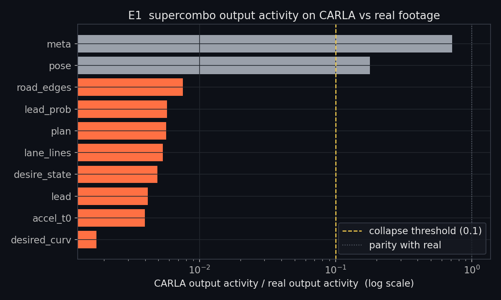
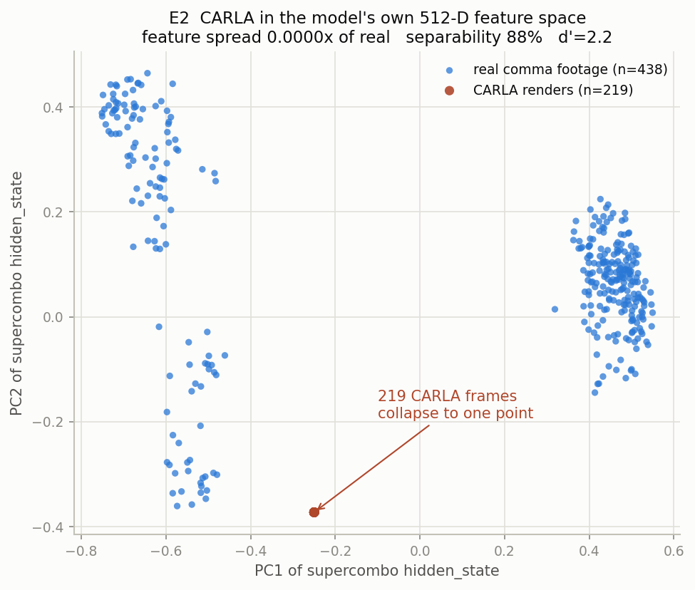
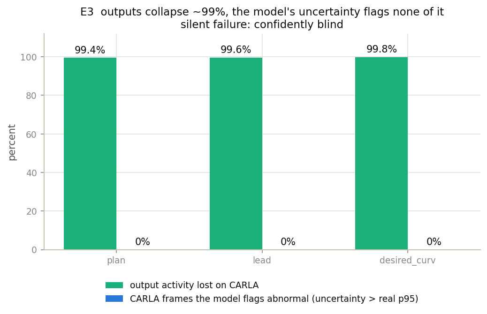

# Does openpilot's driving model know when it's blind?

**A distribution-shift teardown of a production L2 self-driving vision model.**

[](https://github.com/yusufdxb/supercombo-blindspot/actions/workflows/ci.yml)

`supercombo` is the end-to-end neural network that drives [openpilot](https://github.com/commaai/openpilot),
the L2 driver-assistance system running on ~comma hardware on real roads today. This
project instruments openpilot v0.9.7's `supercombo` and asks one safety question:

> When the model is shown input it was never trained on, does it fail loudly, or silently?

The answer, measured: **silently, and completely.** On CARLA-rendered driving scenes,
the model's outputs collapse to a near-constant default across 8 of its 10 output
heads, its internal recurrent state freezes to a single point, and its own predicted
uncertainty rises so little it never leaves the model's normal real-driving range.
Nothing the model emits would tell a downstream monitor it has stopped perceiving.

---

## TL;DR

- Built a **parity-exact** reimplementation of openpilot v0.9.7 `supercombo` inference:
  verified to **100% of 1159 frames within ±0.5 m/s²** of comma's own reference
  output on real footage (median abs delta 0.04 m/s²). This makes the negative
  result below trustworthy: it is the model, not the harness.
- Ran the model on real comma footage vs CARLA renders and instrumented every output
  head, the model's predicted uncertainties, and its internal feature vector.

| Experiment | Finding |
|---|---|
| **E1** output collapse | 8 / 10 output heads (plan, lane lines, road edges, lead, curvature, ...) collapse to **< 1%** of their real-footage temporal activity on sim input |
| **E2** internal OOD | the model's 512-D recurrent feature vector collapses to **0.00001×** the real spread: 219 distinct sim frames map to one frozen point |
| **E3** silent failure | outputs lose **~99.5%** of their activity, but predicted uncertainty rises only 1.2-1.8× and **0%** of sim frames exceed the model's normal real-driving uncertainty |



## Why this matters

Every L2 / autonomous-driving program validates in simulation. If a production
driving model is out-of-distribution-blind to your simulator, sim "passes" are false
confidence: the car looks like it drives (stable, benign, plausible outputs) because
the model has **collapsed to a safe-looking default**, not because it perceives
anything in the scene. And because the model's own uncertainty heads do not flag the
collapse (E3), you cannot catch this from model outputs alone. You need an external
distribution-shift detector.

This is consistent with comma's own experience: openpilot's official simulator bridge
(MetaDrive) is [reported to drive erratically](https://github.com/commaai/openpilot/issues/31711),
and comma uses sim for integration/CI testing, not for trusting model behavior.

## How I got here (the honest version)

This started as an attempt to reproduce a real, documented openpilot failure,
[phantom braking at highway overpass shadows](https://github.com/commaai/openpilot/issues/20704),
inside CARLA. The reproduction harness was built and works: CARLA, comma-3-faithful
dual cameras, kinematic two-phase recurrent-state initialization, a smooth verified
accel trace (`src/scenario.py`).

But the model did not respond to the simulated scenes. Chasing *why* produced the
teardown above. The project pivoted from "reproduce a known bug" to "rigorously
characterize a silent failure mode." The phantom-braking harness stayed in the repo:
it became the control that exposed the real result.

## Rigor and controls

- **Parity control.** `src/run_parity.py` reproduces comma's v0.9.7 reference output
  on a real segment to 100% within ±0.5 m/s². A skeptic's first objection ("your
  reimplementation is buggy") is ruled out before any claim is made.
- **The model is alive on real data.** Every output head has substantial frame-to-frame
  activity on real footage (E1, "real activity" column). The collapse is sim-specific.
- **Two real segments, two vehicles** (Subaru highway, RAM), each warmed from an
  independent recurrent state with the warmup transient discarded, so the "real"
  baseline is not one recording and is not contaminated by initialization.
- **Honest negative result on the original goal.** `src/scout_phantom.py` scanned
  v0.9.7's output on real drives for phantom brakes; it found legitimate curve and
  intersection braking and **no confirmed phantom brake** in the sample. Phantom
  braking is rare and the easily accessible data is failure-poor: a real finding
  about the difficulty of the original problem, reported rather than hidden.

## The experiments

### E1 — Output collapse map

Per output head, the temporal activity (mean per-element standard deviation across
frames) on CARLA vs real footage. A head whose activity collapses is one the model
has stopped driving from.

8 of 10 heads collapse below 1% of real activity, including every perception head
(`lane_lines`, `road_edges`, `lead`) and every planning head (`plan`, `accel`,
`desired_curv`, `desire_state`). `pose` (ego-motion) partially survives at 18%,
plausibly because it is driven by frame-to-frame optical flow, which retains some
signal even in sim. `meta` (disengage / blinker probabilities) is low-activity on
real footage too. Full table: [`report/teardown_results.md`](report/teardown_results.md).

### E2 — Out-of-distribution inside the model



`supercombo` is recurrent: it carries a 512-D `hidden_state` feature vector. Projected
to 2-D (PCA fit on real features), real driving spreads across the feature space while
**219 distinct CARLA frames collapse to a single point** (feature spread 0.00001× of
real). The model is not just producing odd outputs; its internal representation of the
sim world is frozen and degenerate.

### E3 — The silent failure



`supercombo`'s plan / lead / curvature heads emit predicted uncertainties (MDN
standard deviations). If the model "knew" it was out of distribution, those would
spike. They do not: outputs lose ~99.5% of their activity, predicted uncertainty
rises only 1.2-1.8×, and **not one CARLA frame's uncertainty exceeds the model's
95th-percentile uncertainty on normal real driving.** Any monitor thresholded to not
false-alarm on real driving would never fire. The model is confidently blind.

## Limitations

- One model version (openpilot v0.9.7, `supercombo`).
- "Real" is two segments; a larger real corpus would further harden the E1/E2 baseline.
- CARLA only. comma's MetaDrive sim shows consistent erratic behavior (#31711) but is
  not instrumented here.
- The collapse is demonstrated, not yet localized to a layer or mechanism (next step).

## Next

- **E4:** real-to-sim image interpolation, to test whether the collapse is a sharp
  cliff or a gradient.
- Localize the collapse to a layer / feature group.
- Real-data phantom-brake mining at scale, using `src/scout_phantom.py`.

## Reproduce

```bash
# Python 3.10 (CARLA 0.9.15 client constraint); see Pinned versions below.
uv venv --python 3.10 --seed .venv
uv pip install --python .venv/bin/python -r requirements.txt

# parity control: faithful supercombo reimplementation vs comma's reference
env -u PYTHONPATH .venv/bin/python -m src.run_parity

# the teardown (needs data/domain_gap/carla_rgb.npy, captured from a CARLA run)
env -u PYTHONPATH .venv/bin/python -m src.teardown

# unit tests
env -u PYTHONPATH .venv/bin/python -m pytest -q
```

`env -u PYTHONPATH` is used because a sourced ROS 2 environment otherwise shadows
packages; the project venv is self-contained.

## Repo map

| Path | What |
|---|---|
| `src/state.py`, `src/parser.py`, `src/constants.py` | parity-exact `supercombo` inference + recurrent state |
| `src/run_parity.py`, `src/warped_preprocessor.py`, `src/transformations.py` | real-footage parity pipeline (calibrated warp) |
| `src/probe_model.py`, `src/teardown.py` | the E1 / E2 / E3 distribution-shift teardown |
| `src/scenario.py`, `src/sim_preprocessor.py`, `src/path_sampling.py` | CARLA reproduction harness (the control) |
| `src/scout_phantom.py` | phantom-brake scout for real comma drives |
| `report/figures/`, `report/teardown_results.md` | results |
| `references/openpilot-v0.9.7/` | vendored openpilot v0.9.7 source (parity reference) |

## Pinned versions

openpilot **v0.9.7** (`supercombo.onnx`, 51 MB, fetched from the v0.9.7 tag);
onnxruntime-gpu **1.23.2** with `ORT_DISABLE_ALL` graph optimization; Python **3.10**;
CARLA **0.9.15**. Runs on an RTX 5070 (Blackwell sm_120); first inference pays a ~28 s
PTX JIT, then ~2 ms/frame.
